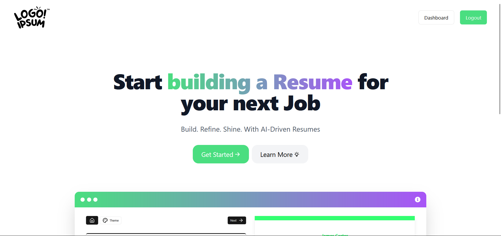
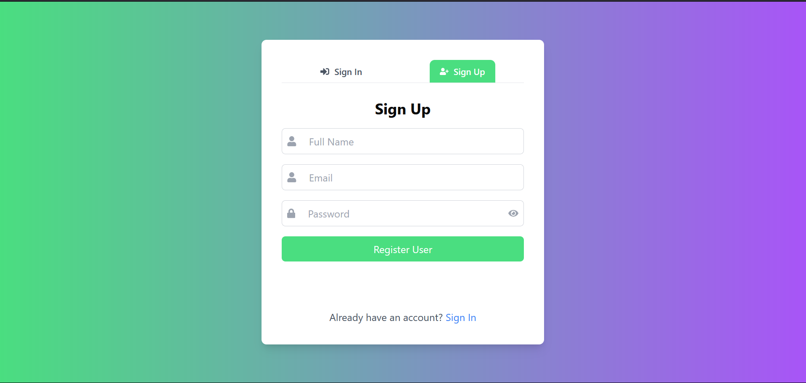
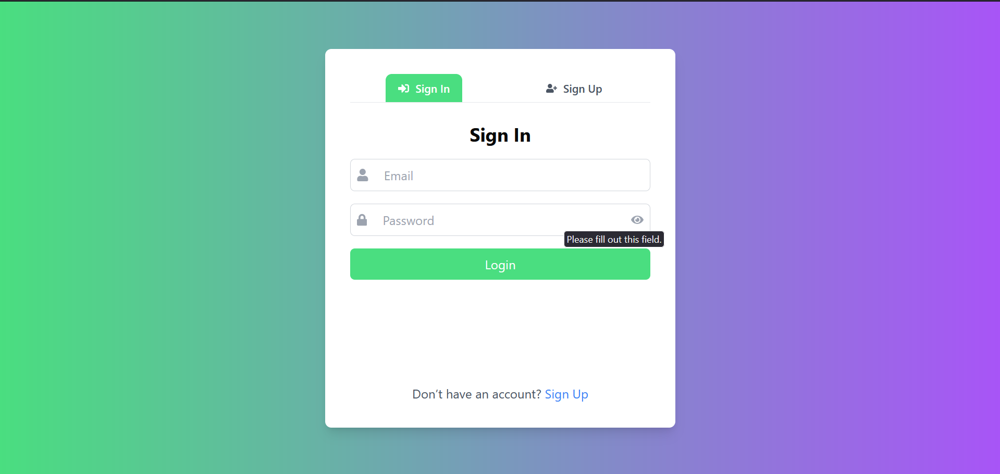

# AI Resume Builder

AI Resume Builder is a sophisticated web application that leverages artificial intelligence to help users craft professional resumes. The application features an intuitive interface and robust backend services for secure data management.

## 📌 Index  

- [Tech Stack](#tech-stack)  
- [Demo](#demo)  
- [Installation](#installation)  
  - [Setup with Docker](#setup-with-docker)  
  - [Setup without Docker](#setup-without-docker)  
- [Features](#features)  
- [Contribution](#contribution)  
- [Developers](#developers)  

---

## Tech Stack

- **Frontend:** React.js, TailwindCSS, Redux Toolkit  
- **Backend:** Node.js, Express.js, Docker  
- **Database:** MongoDB  

## Demo

🌐 Live demo: [AI Resume Builder](https://main--ai-resume-builder-07.netlify.app/)  



---
## Installation

To run AI Resume Builder locally, follow these steps:

### 1️⃣ Clone the Repository

```bash
git clone https://github.com/vikas24012005/Ai-Resume-Builder_Agile.git
cd ai-resume-builder
```

### 2️⃣ Create Environment Files  

Before proceeding, create the necessary environment files for **both frontend and backend**.

#### 🔹 Backend (`Backend/.env`)  

Create a `.env` file inside the `Backend/` directory and add the following:  

```plaintext
MONGODB_URI={Your MongoDB URI} # If using Docker: mongodb://mongodb:27017/ai-resume-builder
PORT=5001
JWT_SECRET_KEY={Your Secret Key} #example "secret"
JWT_SECRET_EXPIRES_IN="1d"
NODE_ENV=Dev
ALLOWED_SITE=http://localhost:5173
```

#### 🔹 Frontend (`Frontend/.env.local`)  

Create a `.env.local` file inside the `Frontend/` directory and add the following:  

```plaintext
VITE_GEMENI_API_KEY={Your Gemini API Key}
VITE_APP_URL=http://localhost:5001/
```

### 3️⃣ Choose a Setup Method  

Now, you can **choose** to set up the project **with or without Docker**.

---

### 🚀 Setup with Docker

1. Navigate to the backend directory:
    ```bash
    cd Backend/
    ```

2. Run the Docker Compose file:
    ```bash
    docker-compose up -d
    ```

3. Start the frontend server:
    ```bash
    cd ../Frontend/
    npm install
    npm run dev
    ```

---

### 🔧 Setup without Docker

#### **Frontend Setup**

1. Navigate to the frontend directory and install dependencies:
    ```bash
    cd Frontend/
    npm install
    ```

2. Start the frontend server:
    ```bash
    npm run dev
    ```

#### **Backend Setup**

1. Navigate to the backend directory and install dependencies:
    ```bash
    cd Backend/
    npm install
    ```

2. Start the backend server:
    ```bash
    npm run dev
    ```

---

## Features

### 1. 🔒 Secure User Authentication  
- Custom authentication with **bcrypt** password hashing  
- **JWT-based** session management  

  
  

### 2. 🏠 User Dashboard  
- View and manage previous resume versions  

  

### 3. 🎨 Customizable Templates  
- Choose from multiple resume templates  

  

### 4. 🤖 AI-Powered Suggestions  
- Smart resume content suggestions  

  

### 5. 🔍 Live Preview  
- See real-time resume updates  

  

### 6. 📄 Export Options  
- Download resumes in **PDF format**  

  
