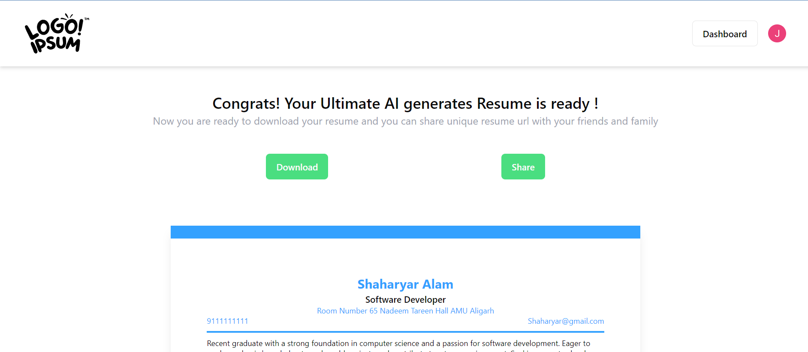

Here's the revised content reflecting your custom user authentication setup:

---

# AI Resume Builder

AI Resume Builder is a sophisticated web application that leverages artificial intelligence to empower users in crafting professional resumes. The application features an intuitive interface and robust backend services for secure data management.

## Tech Stack

**Frontend:** React JS, TailwindCSS, Redux Toolkit  
**Backend:** Node JS, Express.js  
**Database:** MongoDB  

## Demo

Explore a live demo of the application [here](https://main--ai-resume-builder-07.netlify.app/)


## Installation

To run AI Resume Builder locally, follow these steps:

### Clone the Repository

```bash
git clone https://github.com/your-username/ai-resume-builder.git
cd ai-resume-builder
```

### Frontend Setup

Navigate to the frontend directory and install dependencies:

```bash
cd ai-resume-builder-frontend/
npm install
```

Start the frontend server:

```bash
npm run dev
```

### Backend Setup

Navigate to the backend directory and install dependencies:

```bash
cd Backend/
npm install
```

Start the backend server:

```bash
npm run dev
```

## Features

### 1. Custom User Authentication

Secure login and registration with custom bcrypt password hashing, JWT tokens, and cookie-based session management.

### 2. User Dashboard

Manage and edit previous resume versions from the user dashboard.


### 3. Customizable Templates

Choose from a variety of customizable resume templates.


### 4. AI-Powered Suggestions

AI-driven suggestions for enhancing resume content.


### 5. Live Preview

Real-time preview of resume changes as you edit.


### 6. Export Options

Download resumes in PDF format for easy sharing and printing.



## Demo Video

Watch a demonstration of the application on [YouTube](https://www.youtube.com/your-youtube-video-link)

## Developers

- [@Sahid Raja Ansari](https://www.linkedin.com/in/sahidrajaansari/)
- [@Shaharyar Alam](https://www.linkedin.com/in/shaharyar-alam-305322208/)

---
